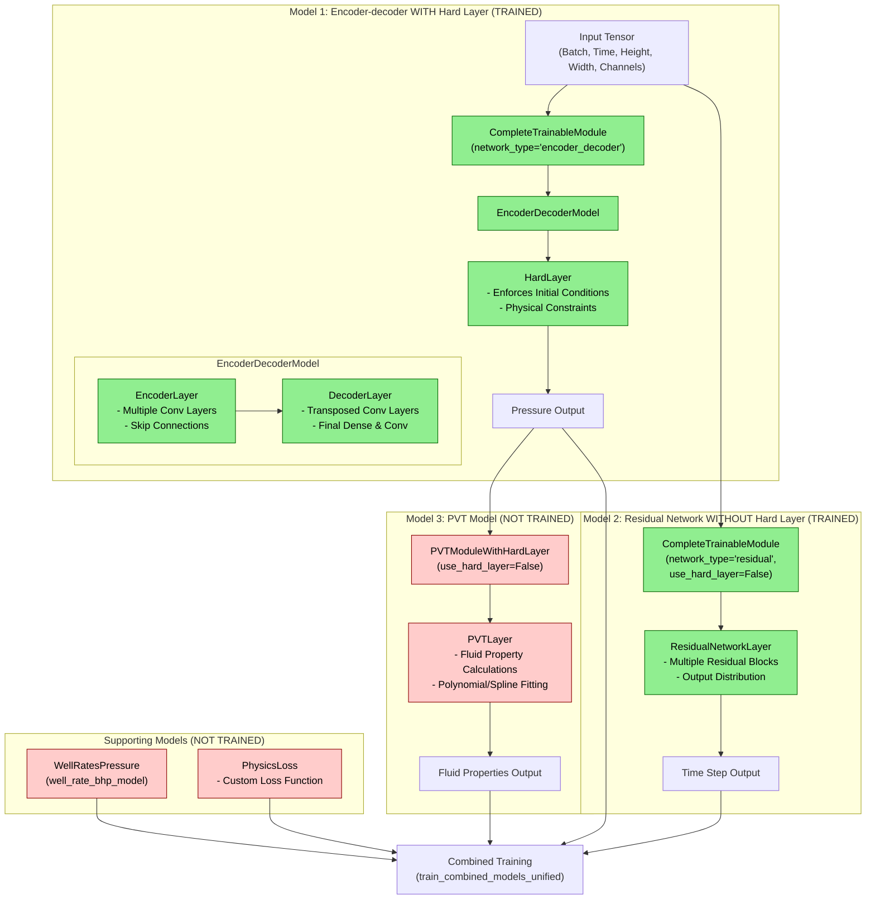

# Network Architecture Explanation

## Model Components

### Trained Components
1. **Encoder-Decoder with Hard Layer (Model 1)**
   - Primarily responsible for predicting pressure values.
   - Consists of encoder-decoder layers constructed using convolutional neural networks on both temporal and spatial dimensions.
   - Features skip connections for gradient flow from encoder to decoder,and to recover spatial features lost during down-sampling or up-sampling in the encoders and decoders, respectively. 
   - The hard layer enforces initial conditions and applies trainable mathematical transformations. Initial conditions are hard-enforced, ensuring the initial conditions are fully satisfied in the output field.

2. **Residual Network (Model 2)**
    - A novel layer that predicts variable time steps for solving the domain partial differential equation (PDE) using finite difference methods (FDM).
    - Does not use a hard layer since time steps can be randomly distributed.
    - Consists of multiple residual blocks with skip connections for transfer learning.
    
3. **Optional Encoder-Decoder without Hard Layer (Model 1*)**
    - Optional layer responsible for predicting saturation values in multi-phase flow problems.
    - follows the same architecture as Model 1.

### Non-Trained Components
1. **PVT Model (Model 3)**
   - Uses the pressure output from Model 1 as input.
   - Calculates fluid properties based on pressure values.
   - Utilizes automatic differentiation (AD) to compute fluid property derivatives with respect to pressure.
   - Incorporates polynomial fitting or parametric spline interpolation methods to approximate fluid properties.
   - This component is not trained by default.

2. **Well Rate & BHP Model**
   - Handles well rate and bottom-hole pressure calculations.
   - Incorporates a well blocking factor to handle viscosity-compressibility effects in highly compressible inner boundary flow.
   - Used during training and inference; contrains no trainable parameters, hence layer is fast.

3. **Physics Loss**
   - Custom loss function that enforces physics-based constraints.
   - Adaptable to single and two-phase flow problems by changing the configuration settings.
   - Guides the training of Models 1, 1*, and 2.

## Data Flow
1. Input tensor flows into both Model 1 (Encoder-Decoder) and Model 2 (Residual Network).
2. Model 1 computes pressure output which is used directly and also fed to Model 3 (PVT).
3. Model 2 computes a variable time step output.
4. Model 3 computes fluid properties from pressure output.
5. All outputs flow into the combined training process.

## Technical Details
- Input shape typically includes spatial property (e.g., permeability, well position indices), temporal dimension, 3D spatial dimensions (height, width, depth), and channels. The spatial property and temporal dimension are woven to give a spatiotemporal dimensional input, which is trained by batching.
- The trained components (green) have trainable weights and biases (variables) that are updated during training.
- The untrained components (red) have fixed weights and parameters.
- Physics-based constraints are integrated into the loss function as penalty terms to regularize the model.

This modular architecture implements a physics‐based artificial intelligence (AI) surrogate for three‑dimensional reservoir flow by integrating the following components:

- Trainable Deep Learning Backbone: interchangeable neural operators (e.g., CNNs, U‑Nets, ResNets) that approximate pressure and (or) saturation solutions over a 3D grid.

- PDE Constraint Module: utlizes FDM on the pressure domain field, and AD on the fluid property domain field of the governing PDE (governing mass‑ and momentum‑balance equations (continuity and Darcy’s law)) to compute residuals.

- Fully Physics‑Augmented Loss: a fully physics-based loss function, which incorporates the PDEs, boundary conditions (e.g., Dirichlet, Neumann), and initial condition regularizations. It also incorporates other developed physics-based constraints, such as time-discretization numerical errors regularization.

By coupling the DL backbone with the fully physics-based regularizations, the AI-based surrogate reservoir model (SRM) learns from features that are inexpensive to generate. The feature dataset does not require expensive and time-consuming numerical simulation numerical simulation to generate, thereby reducing the processing time, as well as the associated net-zero carbon footprint that would be generated by running the numerical simulation--upto 90% of the total processing time. 
The predictions by the AI-based SRM are reliable; its flow-field predictions satisfy mass conservation, fluid compressibility, and boundary-condition constraints. This yields a differentiable, generalizable tool suitable for rapid forecasting, uncertainty quantification, and optimization in low-emission reservoir simulation and reservoir management.